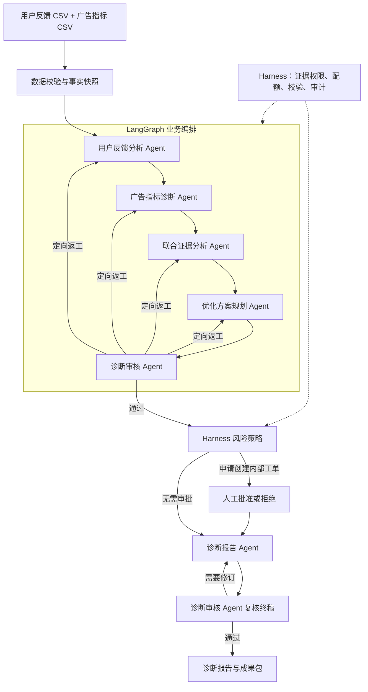

# GrowthTriage

**连接用户反馈与广告指标的多 Agent 联合诊断系统。**

GrowthTriage 面向海外应用的运营、增长与投放分析场景。上传用户反馈和广告指标两份 CSV，系统会识别异常、关联用户反馈、提出待验证的原因假设，并生成实验建议、内部工单和诊断报告。

项目采用 **LangGraph + 六个业务 Agent + Harness 执行控制层**，支持本地单机部署。指标由程序计算，模型负责证据解读与方案生成，需确认的工单操作经过人工审批。

## 解决什么问题

广告指标说明“哪里变差了”，用户反馈提供“为什么可能变差”的线索。GrowthTriage 将两类信息放到同一条可追溯的分析链路中，帮助回答：

- 哪个市场、广告或素材出现了异常？
- 点击率、转化率、安装成本与投放回报发生了怎样的变化？
- 重复曝光、广告承诺与产品体验相关反馈，是否与异常方向一致？
- 有哪些替代解释，需要补充什么证据？
- 下一步应安排什么验证实验，哪些动作需要人工确认？

输出用于辅助排查与决策。证据关联不等于因果证明，实验建议也不代表已经取得业务改善。

## 核心能力

| 能力 | 实现方式 |
| --- | --- |
| 双 CSV 接入 | 校验字段、时间窗口、关联维度和上传限制，生成事实快照 |
| 广告指标分析 | 确定性计算 CTR、CVR、CPI、D7 ROAS 和曝光频次 |
| 六 Agent 协作 | 分角色提示词、结构化输出、受限工具调用与审核返工 |
| 人工审批 | 对内部工单创建进行批准或拒绝，保留决策记录 |
| 执行追踪 | 查看步骤状态、耗时、工具调用、审核意见与产物版本 |
| 报告导出 | 输出结论、证据、实验卡与执行状态，支持 Markdown / JSON |
| 报告阶段恢复 | 对支持重试的模型错误复用已保存草稿，不重复创建工单 |
| 工作区隔离 | 隔离不同会话的数据与结果，提供管理员管理入口 |

## 系统架构



### 六个业务 Agent

| Agent | 职责 | 主要产物 |
| --- | --- | --- |
| 用户反馈分析 Agent | 理解多语言反馈，识别主题与用户陈述 | 反馈分类、主题摘要、证据引用 |
| 广告指标诊断 Agent | 读取计算后的指标，解释异常表现与可能因素 | 指标异常分析、不确定性说明 |
| 联合证据分析 Agent | 关联反馈与指标，保留替代解释 | 候选原因、关联证据、待验证假设 |
| 优化方案规划 Agent | 根据假设设计验证方案 | 实验卡、主指标、护栏指标、观察周期与停止条件 |
| 诊断审核 Agent | 检查分析与证据是否一致，审核方案和终稿 | 审核结论、问题清单、定向返工要求 |
| 诊断报告 Agent | 汇总已审核的分析与执行结果 | 报告摘要、结论与限制说明 |

六个角色按依赖顺序串行执行，由 LangGraph 控制路由，没有额外的协调主 Agent。分析审核最多允许两次返工；报告由同一诊断审核 Agent 复核，最多允许一次报告修订。

每个 Agent 通过 `read_evidence` 工具读取当前任务获授权的事实或上游产物，再提交符合 Pydantic 契约的结构化结果。工作上下文由本次任务的消息、证据、产物版本与审核意见组成，不包含跨用户长期记忆。

### Harness 执行控制

Harness 负责证据访问白名单、输出校验、请求配额、执行时限、风险策略、审批及审计。它与诊断审核 Agent 分工不同：前者执行程序约束，后者检查分析内容的合理性。

| 动作 | 当前处理方式 |
| --- | --- |
| 读取授权证据、生成内容 | 在工具权限和执行预算内运行 |
| 创建内部诊断工单 | 人工审批后写入当前系统 |
| 调整广告预算、出价、停投或扩量 | 仅生成建议，不执行广告账户操作 |

## 技术栈

| 层级 | 技术 |
| --- | --- |
| 前端 | React 19、TypeScript、Vite |
| 后端 | Python 3.12、FastAPI、Pydantic |
| Agent 编排 | LangGraph |
| 模型调用 | DeepSeek API、HTTPX、工具调用与结构化输出 |
| 数据存储 | PostgreSQL、SQLAlchemy                    |
| 部署与测试 | Docker Compose、pytest |

具体依赖版本见 [后端依赖](backend/requirements.txt) 与 [前端依赖](frontend/package.json)。

## 快速开始

### 1. 获取项目

准备 Git、Docker 和支持当前配置的 Docker Compose。Windows 用户可使用 Docker Desktop。

```bash
git clone https://github.com/Merlinlin03/GrowthTriage.git
cd GrowthTriage
```

私有仓库需要先获得访问权限。

### 2. 配置模型

复制配置模板为 `.env`。已有配置时不要覆盖。

```powershell
# Windows PowerShell
Copy-Item .env.example .env
```

```bash
# macOS / Linux
cp .env.example .env
```

在本机编辑 `.env`，填写 `DEEPSEEK_API_KEY`，并按账户可用模型配置 `DEEPSEEK_MODEL`。默认保持 `GT_APP_MODE=production`，使用真实模型执行上传数据的诊断。

`.env` 已被 Git 忽略。真实密钥、管理员密码及其哈希不得写入源码或提交到仓库。

### 3. 构建并启动

```bash
docker compose up -d --build
```

打开 **[http://127.0.0.1:8088/workspace](http://127.0.0.1:8088/workspace)**。

服务默认仅绑定本机 `127.0.0.1:8088`，数据库保存在项目 `data/` 目录。后续启动可使用 `docker compose up -d`；修改代码后重新执行带 `--build` 的命令。

```bash
# 查看运行状态
docker compose ps

# 查看最近日志
docker compose logs --tail=100

# 停止服务
docker compose stop
```

### 4. 可选：启用管理员

在项目目录运行密码哈希生成器，按提示输入密码：

```bash
docker compose run --rm --no-deps growthtriage python -m backend.app.services.admin_auth
```

将生成的完整哈希填入本机 `.env` 的 `GT_ADMIN_PASSWORD_HASH`，用单引号包住，避免 Compose 对其中的 `$` 做变量插值。执行 `docker compose up -d` 重新加载配置。

在页面“管理员”入口使用原始密码登录。普通上传分析无需管理员身份；管理员用于持久工作区、模型连通性检查和工作区管理。

## 使用流程

1. 在工作台点击 **新建诊断**，进入上传页。
2. 上传用户反馈和广告指标两份 CSV，确认数据已脱敏及模型处理告知。
3. 执行数据校验，修正阻断问题后点击 **开始分析**。
4. 在 **联合诊断** 查看进度、指标、证据与 Agent Trace。
5. 如出现工单申请，在 **审批中心** 批准或拒绝；两种决定均可继续生成报告。
6. 终稿审核通过后，在 **成果包** 查看结果并下载 Markdown / JSON。

报告建议先看指标事实，再看关联证据、待验证假设和实验卡，最后确认审批与实际执行状态。实验需由业务人员安排执行，后续可上传新一期数据重新分析。

## 数据输入

上传页提供 CSV 模板，也可使用仓库中的合成样例：

- [用户反馈 CSV](examples/feedback.csv)
- [广告指标 CSV](examples/ad_metrics.csv)

| 文件 | 要求 | 限制 |
| --- | --- | --- |
| 用户反馈 | 每行一条反馈，包含时间、来源、市场及相应关联字段 | 1 MB / 500 行 |
| 广告指标 | 按模板提供素材与市场维度的基准期、当前期数据 | 2 MB / 5000 行 |

两份文件均使用 UTF-8 编码，分析窗口为相邻的两个七日周期。反馈与指标应通过市场、平台、Campaign、Creative 等维度形成有效关联。

上传前请移除个人身份信息、联系方式和凭据。自动校验不能替代完整的数据脱敏。系统不保留原始 CSV 文件，但会将规范化记录与分析产物写入 SQLite；启用模型时，授权证据会发送至所配置的模型服务。

## 配置与运行约束

| 配置项 | 作用 |
| --- | --- |
| `GT_APP_MODE` | `production` 要求配置模型密钥；`local` 支持无密钥规则验证 |
| `DEEPSEEK_API_KEY` | 服务端模型调用凭据 |
| `DEEPSEEK_BASE_URL` | 模型服务地址，生产模式要求 HTTPS |
| `DEEPSEEK_MODEL` | 当前账户可用的模型 ID |
| `GT_LIVE_DAILY_LIMIT` | 每日模型请求额度，默认 30，按 UTC 日期计数 |
| `GT_LLM_REQUEST_TIMEOUT_SECONDS` | 单次模型请求总时限，默认 60 秒，可设 10–180 秒 |
| `GT_ADMIN_PASSWORD_HASH` | 可选管理员密码哈希 |
| `GT_COOKIE_SECURE` | HTTPS 访问时启用安全 Cookie；默认本机 HTTP 为 `false` |

完整配置见 [.env.example](.env.example)。Docker Compose 读取 `.env`；原生 Python 启动读取 `.env.local`，系统环境变量优先于文件配置。

- 访客工作区默认有效期两小时，最多创建三次诊断，失败任务也计入次数。
- 管理员使用持久工作区，当前诊断上限为 1000，登录会话有效期为十二小时。
- 每个工作区最多上传五组数据，同时最多有一个活动诊断。
- 所有角色共享每日模型额度；额度按实际请求数计算，不是诊断次数。一次完整六 Agent 诊断通常至少十四次请求，修复和返工会增加消耗。
- 每个 Agent 最多四个模型回合，传输异常额外重试最多一次；每个任务最多八十次模型请求，分析与报告阶段分别受六百秒时限约束。

## 开发与验证

本地开发需要 Python 3.12 和与前端依赖兼容的 Node.js；Docker 构建使用 Node.js 22。以下命令从项目根目录开始执行，建议使用独立 Python 虚拟环境。

```bash
python -m pip install -r backend/requirements.txt
cd backend
python -m pytest tests -q
cd ../frontend
npm ci
npm run build
```

自动测试覆盖指标计算、上传校验、Agent 输出与工具约束、审核返工、审批幂等、工作区隔离、请求限制和报告恢复。测试使用临时数据库和模拟模型，不需要真实 API Key。

需要验证实际模型调用时，先配置并启动服务，再从项目根目录运行：

```bash
python scripts/live_smoke.py
```

此检查使用合成数据调用真实模型，会消耗模型额度。无密钥规则路径只能验证程序流程，不能用于证明六 Agent 模型调用已连通。

已有验收记录包含六 Agent 真实模型链路、Docker 启动、报告恢复以及 67 项后端回归。这些是已记录的阶段结果，并非对任意环境的保证。完整过程与适用范围见 [交付验收记录](docs/05-交付验收.md)。

## 持久化与故障恢复

任务状态、审批、内部工单与分析产物保存在 SQLite。恢复以已提交的产物为边界：等待审批的任务保持等待，已批准的工单不会因报告重试而重复创建。

报告或终稿复核遇到可重试的模型错误时，页面提供 **仅重试报告阶段**，优先复用已保存草稿，新增请求仍计入配额。没有确定提交点的执行中任务在进程中断后保守失败，避免自动重发可能已计费的模型请求。

仓库提供 [数据库备份工具](scripts/db_backup.py)，支持 SQLite 一致性快照与还原到新文件。备份包含业务数据，应保存在受限目录，不应提交到 GitHub。当前未使用 LangGraph 持久化 checkpointer，不承诺任意节点无损恢复。

## 项目结构

```text
GrowthTriage/
├── backend/
│   ├── app/
│   │   ├── main.py                 # API、会话与访问控制
│   │   ├── db.py                   # 数据模型与持久化
│   │   └── services/
│   │       ├── agent_graph.py      # LangGraph 编排与恢复
│   │       ├── agent_runtime.py    # 模型、工具调用与输出契约
│   │       └── orchestrator.py     # 工作流、策略与报告组装
│   └── tests/
├── frontend/src/                  # 工作台、诊断、审批与成果页面
├── examples/                      # 合成数据与输入样例
├── scripts/                       # 验收、备份和运行检查工具
├── docs/                          # 需求、设计与验收文档
├── .env.example                   # 配置模板，不包含真实凭据
├── compose.yaml
├── Dockerfile
└── SPEC.md
```
